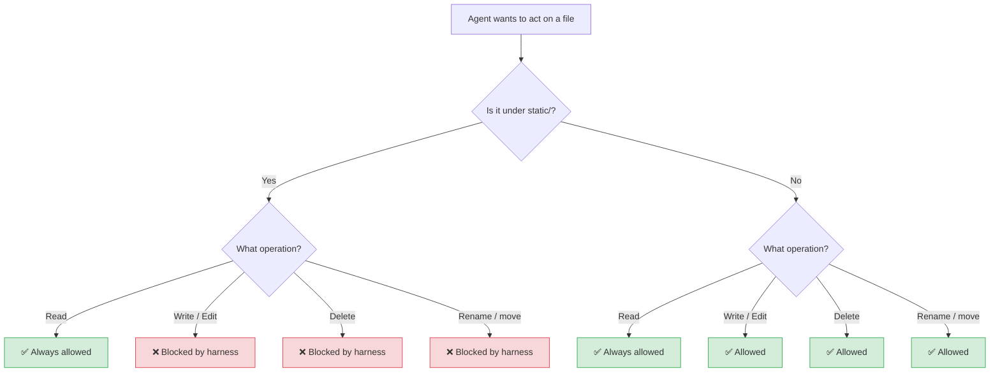
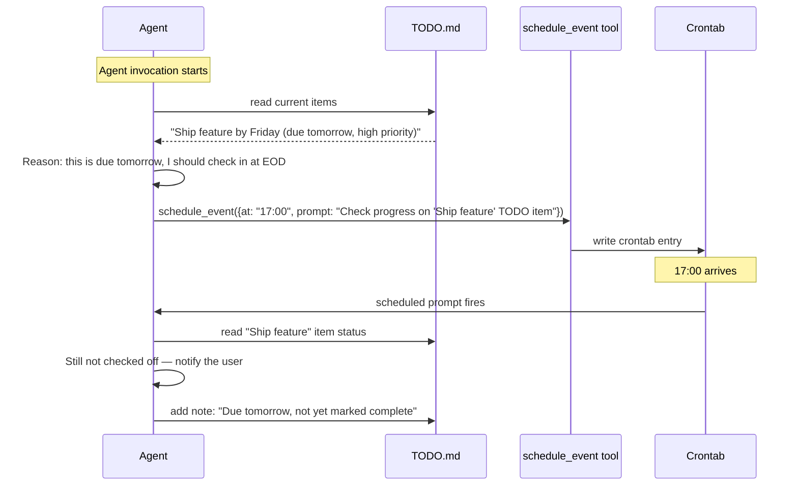
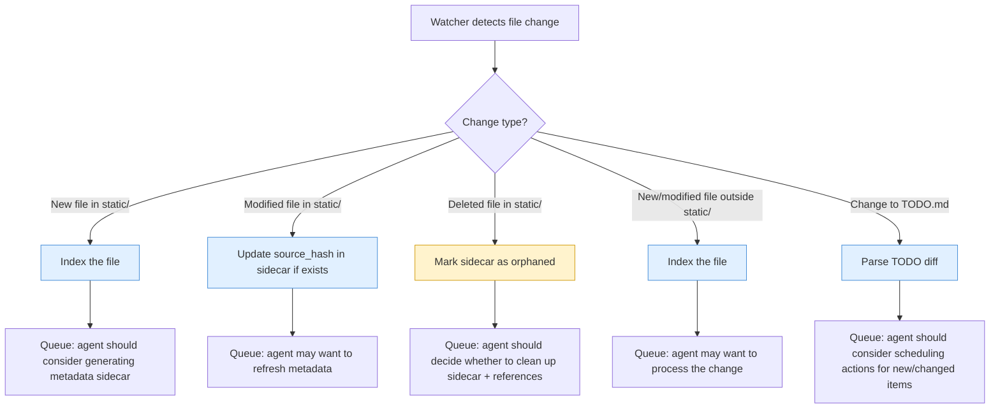

# Brain — Watch Folder Design Proposal

> **Audience:** Developer picking this up for implementation.
> **Status:** Core implemented — brain folder initialization, `static/` enforcement, `topofmind.md` validation. Folder watcher, sidecar metadata generation, and TODO.md management not yet implemented.

## The Idea

The watched folder is the agent's "brain" — a shared filesystem space where the human stores their artifacts and the agent organizes, annotates, links, and builds on top of them. One rule governs everything:

**The `static/` directory is read-only for the agent.** The user places files there when they want to guarantee the agent can never modify, delete, or move them. Everything outside `static/` is fair game — the agent can read, write, edit, and delete freely.

There is no per-file ownership tracking, no manifest, no ownership tags. The permission boundary is a single directory check: is the target path under `static/`? If yes, block writes. If no, allow them.

## Permission Model



The user decides what's protected. If they want a meeting transcript to be immutable, they put it in `static/meetings/`. If they're fine with the agent editing or enriching a file in-place, they leave it outside `static/`.

## Folder Structure

Minimal by design. The human is free to organize files however they want.

```
brain/                          ← the watched folder root
├── .brain/                     ← agent internals (hidden)
│   └── index.json              ← search/link index
├── .meta/                      ← sidecar metadata for files
│   ├── photos/vacation.jpg.meta.json
│   └── meetings/standup.md.meta.json
├── topofmind.md                ← agent-managed context (always loaded by daemon)
├── TODO.md                     ← unified todo file
├── daily-summary/              ← agent-generated summaries
│   ├── 2026-03-05.md
│   └── 2026-03-06.md
├── static/                     ← read-only for the agent
│   ├── photos/
│   │   └── vacation.jpg
│   ├── meetings/
│   │   └── standup.md
│   └── recipes/
│       └── recipe.pdf
│
│   ── everything outside static/ is mutable ──
│
├── notes/
│   └── quick-thought.md
└── drafts/
    └── blog-post.md
```

### Directory Roles

| Path | Agent Access | Purpose |
|---|---|---|
| `.brain/` | Read/Write | Internal bookkeeping — indices, caches. Hidden from casual browsing. |
| `.meta/` | Read/Write | Sidecar metadata files that annotate brain artifacts. One `.meta.json` per file, mirroring the relative path. |
| `topofmind.md` | Read/Write | Agent-managed context file. Loaded by the daemon and combined with the system prompt on every harness invocation. Daemon-enforced constraints: max 2 KB, max 30 lines, no fenced code blocks. |
| `TODO.md` | Read/Write | The unified task/action-item file. Acts as a lightweight database for both the agent and the frontend. |
| `daily-summary/` | Read/Write | Periodic summaries the agent generates. |
| `static/` | **Read-only** | User-protected files. The agent reads freely but all write/edit/delete/move operations are blocked by the harness. |
| Everything else | Read/Write | Mutable space. The agent can create, edit, and delete files here. |

## Sidecar Metadata

When the agent wants to enrich a file — tag a photo, extract keywords from a document, log when it was last referenced — it writes a **sidecar** in `.meta/`.

Example: the user has `static/photos/vacation.jpg` in the brain. The agent detects it, analyzes the image, and writes:

```json
// .meta/static/photos/vacation.jpg.meta.json
{
  "source_path": "static/photos/vacation.jpg",
  "source_hash": "sha256:ab12cd...",
  "created_at": "2026-03-06T14:22:00Z",
  "tags": ["photo", "vacation", "beach", "2025"],
  "description": "Beach sunset photo, likely from July 2025 trip.",
  "extracted_text": null,
  "linked_from": ["daily-summary/2026-03-06.md"],
  "custom": {}
}
```

The `.meta/` directory mirrors the brain's folder structure so paths stay intuitive and collisions are impossible. Note that the agent writes the sidecar to `.meta/` (which is mutable), not to `static/` — the original file is untouched.

The agent decides when to generate sidecars based on context. Rather than eager or lazy generation as a system policy, a repeatable skill or script handles metadata extraction, and the LLM decides when to invoke it based on the current task.

## The Unified TODO File

`TODO.md` is the most important agent-managed file. It serves three roles simultaneously:

1. **Agent context** — The agent reads it on every invocation to understand what's pending, what's been done, and what might need scheduling.
2. **Frontend database** — The companion frontend reads and renders it as a task board. Structured enough to parse, human-readable enough to edit by hand if needed.
3. **Scheduling bridge** — Items in the TODO can trigger the agent to call `schedule_event` (from SCHEDULING.md) to set up deferred actions.

> **Scaling plan:** V1 uses a single monolithic `TODO.md`. V2 will break items into individual files with metadata, linked by an overview file or backed by a database.

### Format

```markdown
# TODO

## Active

- [ ] Ship feature by Friday `origin:meetings/2026-03-06-standup.md` `due:2026-03-07` `priority:high`
- [ ] Review PR #42 `origin:agent` `due:2026-03-06` `priority:medium`
- [x] Send weekly summary `origin:cron/weekly-summary` `completed:2026-03-06T17:00:00Z`

## Someday

- [ ] Organize photos folder by year `origin:agent` `priority:low`

## Done (last 7 days)

- [x] Retrieve standup transcript `origin:schedule/evt_abc123` `completed:2026-03-06T10:36:00Z`
```

### Key Properties

- **Inline metadata** via backtick-wrapped key-value pairs — parseable by both the frontend and the agent, invisible clutter to a human skimming the file.
- **`origin` tag** — Links every item back to where it came from: a human file, a scheduled event, a cron task, or the agent's own initiative.
- **Sections** — `Active`, `Someday`, `Done`. The agent manages section placement. Completed items roll into `Done` and are pruned after a configurable TTL.
- **Format decision** — V1 uses inline backtick pairs. Simple, grep-friendly, survives copy-paste.

### How the TODO Connects to Scheduling



## How the Watcher Interacts with the Brain

When the Folder Watcher detects a change, the Event Router classifies it before forwarding to the agent:



## Agent-to-Agent Linking

The agent can create **link files** — small markdown documents whose primary purpose is to connect related artifacts:

```markdown
<!-- daily-summary/2026-03-06.md -->
# Daily Summary — March 6, 2026

## Meetings
- [Standup transcript](../static/meetings/2026-03-06-standup.md) — Action items extracted to TODO.md

## New Files
- [vacation.jpg](../static/photos/vacation.jpg) — Beach sunset, auto-tagged

## Scheduled
- 17:00 — EOD TODO review
```

These files are disposable. They give the agent (and the human) a narrative view of what happened, while the files in `static/` remain untouched.

## Implementation Notes

### Harness enforcement (implemented)

The `static/` permission check happens **inside the tool handler**, not in the LLM prompt. Prompts can be ignored; tool-level checks cannot. The `write_file` handler calls `brain.ValidateWritePath()` which:

1. Resolves the target path to absolute.
2. Checks it's inside the brain folder (`brain.IsInsideBrain`).
3. Checks if it falls under `brain/static/` (`brain.IsStaticPath`).
4. If either check fails, the write is blocked with a descriptive error returned to the LLM.

This uses `filepath.Abs` + `strings.HasPrefix` checks. No manifest, no ownership database, no per-file metadata to maintain.

### `topofmind.md` enforcement (implemented)

The `write_file` handler detects writes to `topofmind.md` and runs `brain.ValidateTopOfMind()` which enforces:
- Max 2048 bytes (2 KB)
- Max 30 lines
- No fenced code blocks (`` ``` ``)

If validation fails, the write is rejected with a clear error.

### Brain folder initialization (implemented)

On first run (via `carson init` or `carson start`), `brain.Init()` creates `.brain/`, `.meta/`, `static/`, `daily-summary/`, and an empty `topofmind.md` if they don't exist. If `.meta/` already exists, Carson assumes it was created for Carson's use. No scanning or bootstrapping is needed — the permission model is purely path-based.

### Frontend protocol

The frontend reads `TODO.md` and the `.brain/` directory directly from disk. No API needed — the watch folder *is* the API. The frontend watches for changes the same way Carson does.

### TODO.md conflict resolution

Both the frontend and the agent can write to `TODO.md`. For V1, last write wins. The frontend's writes should take priority in practice (the user is actively interacting), but no locking or change-queuing mechanism is implemented initially. If conflicts become a real problem, we'll revisit with a more structured approach.

### Decisions

All brain/watch-folder questions have been resolved. See [QUESTIONS.md](QUESTIONS.md) under **Brain / Watch Folder** for the full decision log.
