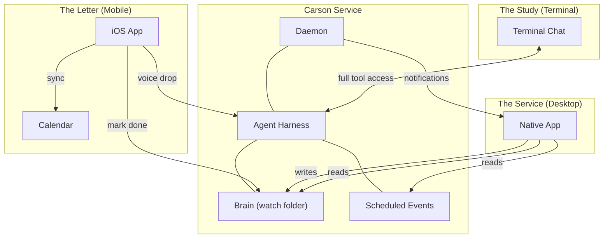
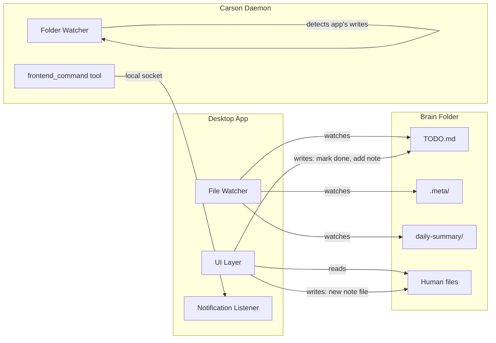
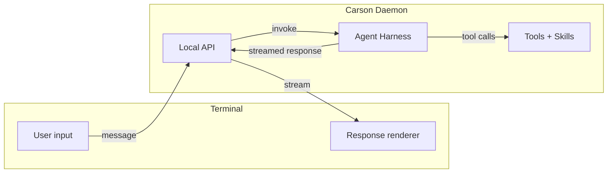
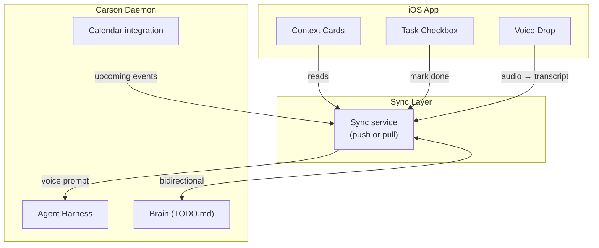
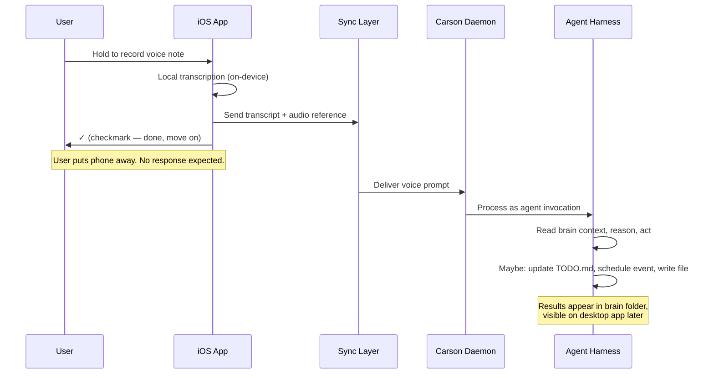
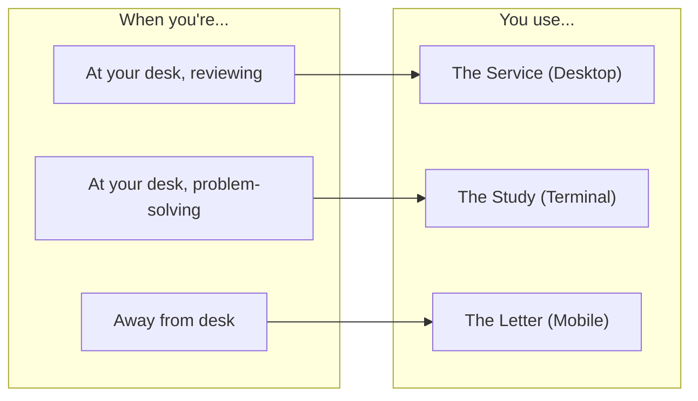

# Frontend Surfaces — Design Proposal

> **Audience:** Developer picking this up for implementation.
> **Status:** Decisions finalized — not yet implemented.

## Three Surfaces, One Butler

Carson's frontend is not a single app. It's three surfaces, each suited to a different mode of interaction — like a butler who behaves differently in the dining room, the study, and while delivering a note upstairs.

| Surface | Codename | Platform | Metaphor | Primary role |
|---|---|---|---|---|
| **Desktop App** | *The Service* | macOS, Linux | A formal dinner service — polished, structured, everything in its place | Task dashboard, notifications, note-taking, full brain visibility |
| **Terminal Chat** | *The Study* | Any terminal | A fireside 1:1 in the office — direct, conversational, nothing off-limits | LLM chat with full tool access, problem-solving, power-user escape hatch |
| **Mobile App** | *The Letter* | iOS (only) | A note slipped under the door — brief, low-ceremony, no oversight expected | Quick task triage, voice-drop messages, calendar-synced context cards |



---

## Surface 1: The Service (Desktop App)

The primary surface. A native app for macOS and Linux that presents the brain's contents as a structured, visual workspace. This is where the human spends time *with* Carson — reviewing what the agent has done, adding their own notes, and staying on top of tasks.

### What it does

- **Task board** — Renders `TODO.md` as a visual task list. Items can be checked off, reordered, and filtered by origin, priority, or due date.
- **Notifications** — The agent updates files (e.g., `TODO.md`) which the desktop app picks up automatically via file watching. Beyond that, `frontend_command` can trigger native OS push notifications with text content only. No in-app notification center for V1.
- **Brain browser** — File tree of the watch folder with sidecar metadata rendered inline. Human files show agent-added tags, descriptions, and links. Agent files are visually distinguished.
- **Quick note** — A fast-entry input for capturing notes during meetings or after milestones. Notes land in `brain/static/` so the agent can read but never modify them. The agent picks them up via the watcher.
- **Daily summary view** — Renders the agent's daily summary files with timeline visualization.
- **Scheduling visibility** — Shows pending scheduled events from SCHEDULING.md, their chains, and next fire times.

### What it does NOT do

- Run LLM inference directly. All agent interactions go through the Carson daemon.
- Provide a chat interface. That's the terminal's job.
- Allow arbitrary file manipulation. It's a viewer and task manager, not an IDE.

### How it connects to Carson

The desktop app reads from the brain folder directly — it watches the same directory Carson does. For write operations (marking a task done, adding a note), it writes to the brain folder and lets the watcher pick up the change.

For notifications and commands, the app listens on a local socket or named pipe that the daemon's `frontend_command` tool writes to.

**Toolkit:** The desktop app will be built with [Tauri](https://tauri.app/) (Rust + web view). If we run into issues — particularly around the backend contract — we'll fall back to [Wails](https://wails.io/) (Go + web view).



### Design character

Polished. Quiet. Information-dense without feeling cluttered. Think: a well-set table — everything has a place, nothing is extraneous. The agent's work is presented as fait accompli. The human reviews, approves, and occasionally adds. The app should feel like opening a briefing, not like babysitting a bot.

---

## Surface 2: The Study (Terminal Chat)

A TUI (terminal user interface) chat application. This is the surface for when the human wants to *talk* to Carson directly — ask questions, debug problems, issue ad-hoc instructions, or do anything that doesn't fit the structured desktop experience.

### What it does

- **Conversational LLM chat** — Full back-and-forth with the agent. Messages are streamed. The agent has its complete personality and context.
- **Full tool access** — The chat session connects to the agent harness with the same tool surface as any other invocation. The agent can read/write brain files, call external services, schedule events, emit frontend commands — everything.
- **Brain-aware context** — The agent automatically has the brain's `TODO.md`, recent daily summaries, and pending scheduled events in its context window.
- **Session history** — Conversations persist locally as JSON lines (`.jsonl`) files. Session maintenance compacts older sessions into historical files weekly, with historical files purged after 30 days.

### What it does NOT do

- Provide a graphical file browser or task board. Use the desktop app for that.
- Act as the primary interface for casual task management. It's a power-user tool.
- Run without the Carson daemon. The terminal chat is a client that connects to the running service.

### How it connects to Carson

The terminal chat connects to the daemon over a local transport (Unix socket or localhost HTTP). It sends user messages and receives streamed agent responses. Tool calls execute server-side in the daemon — the terminal is purely a rendering layer.

The terminal chat is invoked as `carson chat` — a subcommand of the main binary, not a separate binary. If the chat feature grows complex enough to warrant separation, we can break it out later and redesign the underlying communication.



### Design character

Minimal. Fast. No chrome. The terminal chat should feel like sitting across from someone competent and getting straight to the point. Keyboard-driven. Markdown-rendered output. Code blocks with syntax highlighting. No animations, no loading spinners longer than necessary — just a blinking cursor and then an answer.

---

## Surface 3: The Letter (Mobile App)

An iOS app stripped to the bare essentials. The mobile surface is not for *working with* Carson — it's for staying connected to your context when you're away from your desk, and for dropping quick inputs that Carson will handle later.

### What it does

Two inputs, one output:

**Inputs:**
1. **Mark task done** — Pull up a task from the synced TODO list. Tap the checkbox. Done. The state change syncs back to the brain's `TODO.md`.
2. **Voice drop** — Record a voice message that gets transcribed and delivered to the agent as a prompt. No response is shown. The user gets a single checkmark confirming the message was received. Like dropping a sealed note on the butler's tray.

**Output:**
- **Context cards** — Calendar-synced flashcards that surface relevant tasks and brain context around upcoming events. Before a meeting, the card shows: related TODO items, recent notes from that project, the agent's last summary. The user flips through cards like a quick briefing.

### What it does NOT do

- Show agent responses to voice drops. The agent processes them asynchronously. Results appear in the brain (and therefore in the desktop app or terminal).
- Provide a chat interface. No back-and-forth.
- Allow file browsing, note creation, or any manipulation beyond the two inputs.
- Run on Android (for now).

### How it connects to Carson

The mobile app needs a sync layer since it can't watch the brain folder directly. V1 uses Tailscale or WireGuard to tunnel to the local Carson daemon. Where design decisions would prevent a future relay-service drop-in, those are documented as tech debt. The long-term goal is user's choice between WireGuard/Tailscale or a cloud relay.



### Context cards in detail

The killer feature of the mobile surface. Cards are generated by the agent based on calendar events and brain state:

Schedule chains (from SCHEDULING.md) help Carson manage card relevance — e.g., a pre-meeting chain generates and refreshes the card as the meeting approaches.

```
┌─────────────────────────────────┐
│  📅 Standup — in 15 min         │
│                                 │
│  Related:                       │
│  • TODO: Ship feature by Friday │
│  • Note: meeting-notes/prev.md  │
│  • Summary: Yesterday's standup │
│    had 2 carry-over items       │
│                                 │
│  ─────────────────────────────  │
│  [Mark "Ship feature" done ✓]   │
│  [Drop voice note 🎤]           │
└─────────────────────────────────┘
```

Cards appear automatically based on time proximity to calendar events. No manual navigation — the app opens to whatever's relevant *right now*.

### Voice drop flow



### Offline behavior

The mobile app is offline-capable with queued writes. Context cards are pre-generated and cacheable. Task completions and voice drops are stored locally and synced when connectivity returns. The app clearly indicates whether it's offline because the phone lacks connectivity or because the Carson daemon is unreachable — these are different failure modes with different user actions.

### Design character

Invisible. The best interaction is the shortest one. Open the app, glance at the context card, maybe check a box, close the app. The voice drop should feel like leaving a voicemail for someone you trust completely — say what you need, hang up, forget about it. No cognitive overhead. No "did it work?" anxiety — just the checkmark.

---

## How the Surfaces Relate

The three surfaces never compete. Each has a clear lane:



### Shared state, separate concerns

All three surfaces read from and write to the same brain folder (directly or via sync). There is no surface-specific state. If you mark a task done on mobile, it's done in the desktop app and visible to the terminal agent. If the agent writes a summary, it appears on all three surfaces.

| Capability | Desktop | Terminal | Mobile |
|---|---|---|---|
| View tasks | Full board | Via agent | Context cards |
| Complete tasks | Click checkbox | Ask the agent | Tap checkbox |
| Add notes | Quick-note input | Tell the agent | Voice drop |
| Chat with agent | No | Yes (primary) | No |
| Browse brain files | Yes (primary) | Via agent | No |
| Receive notifications | Yes | No | No (silent) |
| Calendar context | No | Via agent | Yes (primary) |
| Schedule actions | No | Via agent | No |
| Full tool access | No | Yes | No |

### Decisions

All frontend questions have been resolved. See [QUESTIONS.md](QUESTIONS.md) under **Frontend Surfaces** for the full decision log.
