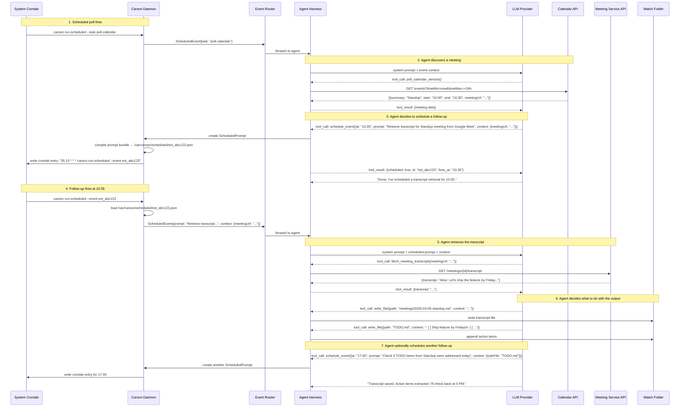
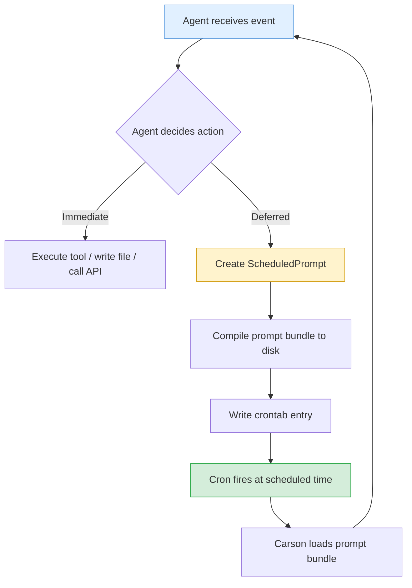
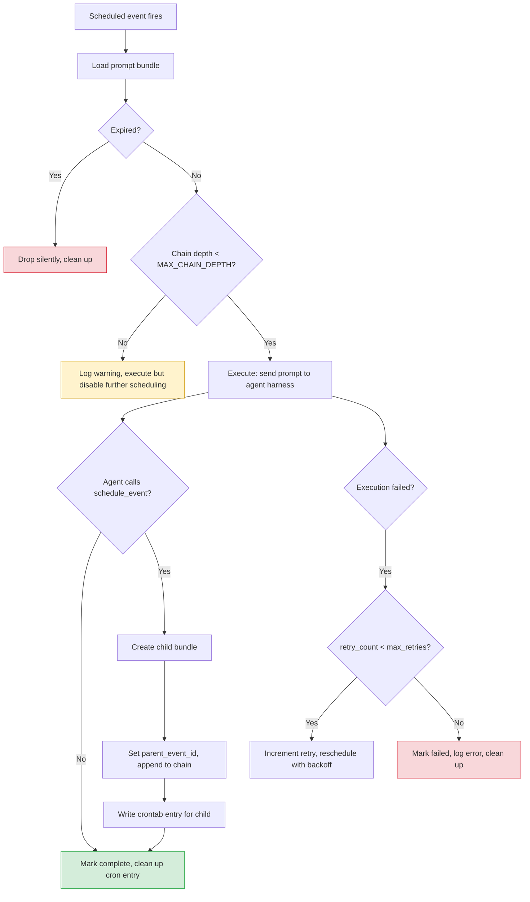
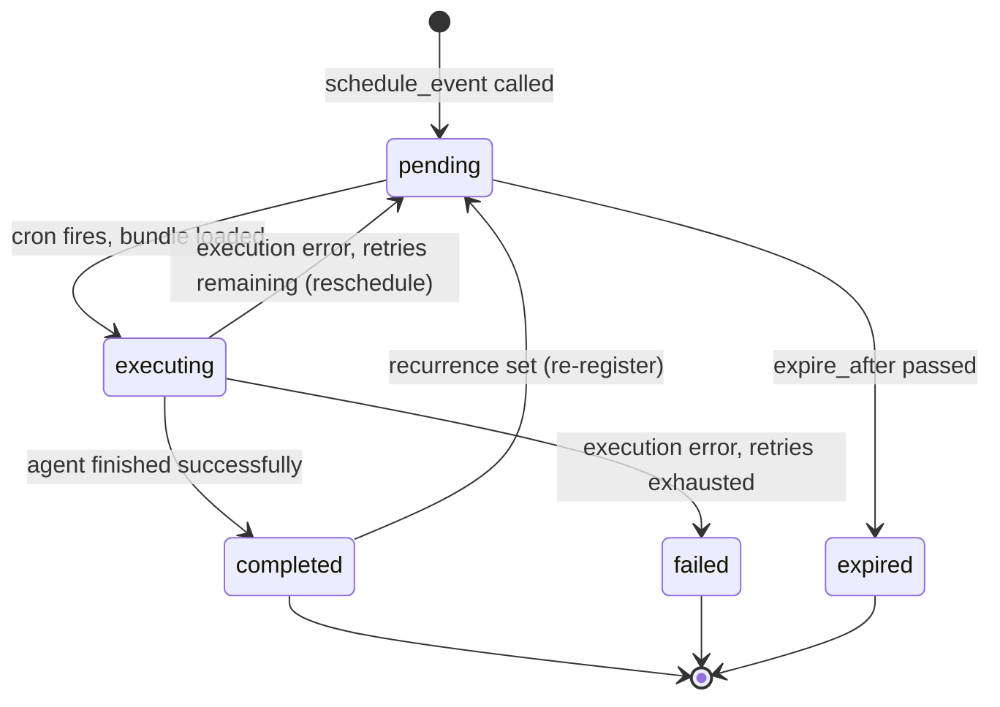
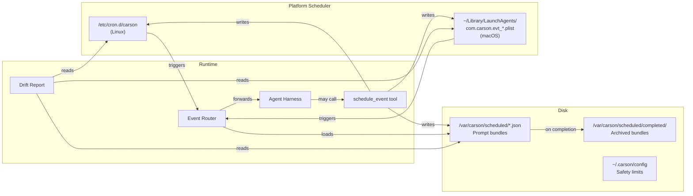

# Recursive Scheduled Events — Design Proposal

> **Audience:** Developer picking this up for implementation.
> **Status:** Decisions finalized — not yet implemented.

## The Problem

Carson's agent needs to do more than react to file changes and respond to direct prompts. It needs to **discover future events, schedule actions around them, and chain follow-up actions whose shape isn't known until runtime.**

A concrete example: the agent polls a calendar service, sees a meeting at 10:00–10:30, and decides on its own to check back at 10:35 for the transcript. When it retrieves the transcript, the agent decides what to do next — maybe it writes the transcript to the watch folder, maybe it also extracts action items into a TODO file, maybe it schedules *another* check for 11:00 to see if follow-up items were assigned. The key property is that **each scheduled callback re-enters the agent, and the agent's output can include scheduling more callbacks.** This is what makes it recursive.

## End-to-End Walkthrough

Before diving into components, here is the full lifecycle of one recursive scheduling chain:



## Core Concept: The Scheduled Prompt

The unit of work is a **ScheduledPrompt** — a self-contained bundle that tells Carson: "At time T, wake the agent with this prompt and this context." When the agent runs, its output may include creating *more* ScheduledPrompts. That's the recursion.



## The `schedule_event` Tool

This is the dedicated tool the agent calls to schedule a future action. It is the only way the agent can write to the crontab.

### Tool Schema

```json
{
  "name": "schedule_event",
  "description": "Schedule a future prompt to be delivered to the agent at a specific time. The prompt will re-enter the agent harness as if it were a new event. Use this to set up follow-up actions, recurring checks, or any deferred work.",
  "parameters": {
    "type": "object",
    "properties": {
      "at": {
        "type": "string",
        "description": "When to fire. Accepts ISO-8601 datetime (e.g. '2026-03-06T10:35:00') or relative shorthand (e.g. '+30m', '+2h', 'tomorrow 09:00')."
      },
      "prompt": {
        "type": "string",
        "description": "The natural-language prompt that will be delivered to the agent when this event fires. Should be specific and self-contained — the agent that receives it may not have the current conversation context."
      },
      "context": {
        "type": "object",
        "description": "Structured key-value data attached to the prompt. Passed verbatim to the agent at fire time. Use this for IDs, URLs, file paths, or any data the future prompt will need.",
        "additionalProperties": true
      },
      "recurrence": {
        "type": "string",
        "description": "Optional cron expression for recurring events (e.g. '0 9 * * 1-5' for weekday mornings). If set, the event re-schedules itself after each execution. Omit for one-shot events.",
        "default": null
      },
      "max_retries": {
        "type": "integer",
        "description": "How many times to retry if the scheduled execution fails (e.g. network error fetching a transcript). 0 = no retries.",
        "default": 2
      },
      "expire_after": {
        "type": "string",
        "description": "ISO-8601 datetime after which this event should be silently dropped rather than executed. Safety net for one-shot events that become stale.",
        "default": null
      }
    },
    "required": ["at", "prompt"]
  }
}
```

### Tool Return Value

```json
{
  "scheduled": true,
  "id": "evt_abc123",
  "fires_at": "2026-03-06T10:35:00-05:00",
  "cron_entry": "35 10 6 3 * carson run-scheduled --event evt_abc123",
  "bundle_path": "/var/carson/scheduled/evt_abc123.json"
}
```

## The ScheduledPrompt Bundle

When the agent calls `schedule_event`, Carson compiles a JSON file to disk. This is the source of truth — the crontab entry is just a trigger that points to it.

```json
{
  "id": "evt_abc123",
  "created_at": "2026-03-06T09:12:44Z",
  "fires_at": "2026-03-06T10:35:00-05:00",
  "status": "pending",
  "prompt": "Retrieve the transcript for the 'Standup' meeting that ended at 10:30 from Google Meet and save it to the watch folder. Extract any action items into TODO.md.",
  "context": {
    "meetingUrl": "https://meet.google.com/abc-defg-hij",
    "meetingSummary": "Standup",
    "meetingEnd": "2026-03-06T10:30:00-05:00"
  },
  "recurrence": null,
  "max_retries": 2,
  "retry_count": 0,
  "expire_after": "2026-03-06T18:00:00-05:00",
  "parent_event_id": null,
  "chain": ["evt_abc123"]
}
```

### Key Fields

| Field | Purpose |
|---|---|
| `prompt` | The full natural-language instruction for the agent. Must be self-contained. |
| `context` | Structured data the agent will need. Passed into the harness alongside the prompt. |
| `recurrence` | If set, the event is re-registered after execution instead of being marked complete. |
| `parent_event_id` | Links to the event that spawned this one. Enables chain tracing. |
| `chain` | Ordered list of all event IDs in this recursive chain. Enables depth limiting. |

## Crontab Isolation

**Decision (2026-03-11):** Carson uses a **platform-separated crontab** that is fully isolated from the user's personal crontab. The daemon runs as the human user (required for brain folder access), but scheduling lives in its own space.

### Platform Strategy

| Platform | Mechanism | Why |
|---|---|---|
| **Linux** | `/etc/cron.d/carson` — a drop-in cron file | Completely separate from user's `crontab -l`. Standard cron.d convention. Requires root to write; `carson init` sets this up (or a small setuid helper). |
| **macOS** | `~/Library/LaunchAgents/com.carson.evt_*.plist` per event | Each scheduled event is a launchd agent. Completely separate from any crontab. Carson already has launchd abstraction in `manager_darwin.go`. |

This eliminates the shared-crontab problem: the user can freely edit their own crontab without causing drift with Carson's scheduled events, and vice versa.

### Why Not a Dedicated System User

A `carson` system user was considered for crontab isolation. Rejected because the daemon must run as the human user to have natural read/write access to the brain folder. The brain folder's value depends on zero-friction access — the user drops files in from any terminal, Finder, etc. Requiring group permissions or ACLs for that access defeats the purpose.

### Example: Linux `/etc/cron.d/carson`

```crontab
# Carson managed — this file is fully owned by the carson daemon.
# Do not edit manually; use `carson schedule list` to inspect.
SHELL=/bin/bash

# [evt_abc123] Retrieve transcript for Standup meeting
35 10 6 3 * liz /usr/local/bin/carson run-scheduled --event evt_abc123
# [poll-calendar] Regular calendar poll
*/30 9-17 * * 1-5 liz /usr/local/bin/carson run-scheduled --task poll-calendar
```

Note: `/etc/cron.d/` entries require specifying the user field (6th field before the command).

### Example: macOS LaunchAgent

Each event becomes a plist at `~/Library/LaunchAgents/com.carson.evt_abc123.plist` with a `StartCalendarInterval` key. Carson's existing launchd abstraction handles creation and removal.

### Source of Truth

**The crontab/launchd entry is authoritative for "should this fire?"** The bundle file is authoritative for "what should it do?" and "what happened last time?"

| Question | Authority |
|---|---|
| Is this event scheduled to fire? | Crontab (Linux) / LaunchAgent (macOS) |
| What prompt/context does it carry? | Bundle file |
| What's its execution history? | Bundle file |

Reconciliation rule: **cron wins on scheduling.** If the cron entry is gone, the bundle is effectively cancelled regardless of its status field. If a bundle is gone but a cron entry exists, the cron entry is removed (nothing to execute).

### Drift Report Tool

Carson provides a `schedule drift` subcommand (and an agent tool `check_schedule_drift`) that compares the crontab/launchd state against the bundle directory and reports mismatches without mutating either side. This makes the system self-healing: the agent or the user can inspect drift and decide what to do.

```
$ carson schedule drift
OK   evt_abc123  fires_at=2026-03-06T10:35  cron=present  bundle=pending
DRIFT evt_def456  fires_at=2026-03-06T14:00  cron=missing  bundle=pending
DRIFT evt_ghi789  fires_at=2026-03-06T09:00  cron=present  bundle=missing
```

The `run-scheduled` subcommand:
1. Loads the bundle from disk. If missing, logs a warning, removes the cron entry, exits.
2. Checks `expire_after` — drops silently if stale, cleans up cron entry.
3. Checks bundle status — if already `completed`, exits early, cleans up cron entry (idempotent).
4. Sends the prompt + context into the Event Router.
5. On success: marks the bundle `completed` (or re-registers if `recurrence` is set).
6. On failure: increments `retry_count`, re-schedules with backoff if under `max_retries`.
7. Cleans up the cron entry for completed one-shot events.

## Recursion & Safety

The recursive property — an agent invocation producing more scheduled invocations — needs guardrails.



### Safety Limits

| Limit | Default | Purpose |
|---|---|---|
| `MAX_CHAIN_DEPTH` | 10 | Prevents infinite recursive scheduling. After this depth, the agent can still execute but `schedule_event` calls are rejected. |
| `MAX_PENDING_EVENTS` | 50 | Total number of pending scheduled events across all chains. Prevents runaway accumulation. |
| `MIN_SCHEDULE_DELAY` | 60 seconds | The agent cannot schedule something less than 60s in the future. Prevents tight loops. |
| `MAX_SCHEDULE_HORIZON` | 7 days | Events cannot be scheduled more than 7 days out. Forces the agent to use `recurrence` for long-lived patterns. |
| `RETRY_BACKOFF` | Exponential: 2m, 8m, 32m | Failed events are retried with increasing delay. |

## State Machine for a ScheduledPrompt



## Data Flow: Where Things Live



## Example: Full Meeting Transcript Chain

To make this concrete, here is exactly what happens when the calendar poll discovers a meeting:

### Step 1 — Calendar poll (recurring, runs every 30 min during work hours)

The agent receives the `poll-calendar` task. It calls the calendar skill, gets back a list of upcoming meetings, and schedules a follow-up for each one:

```
Agent prompt: "Poll the user's calendar for upcoming events in the next 2 hours."
Agent response:
  → tool_call: poll_calendar_service()
  → result: [{summary: "Standup", end: "10:30", meetingUrl: "..."}]
  → tool_call: schedule_event({
      at: "2026-03-06T10:35:00",
      prompt: "The user's 'Standup' meeting just ended. Retrieve the transcript from Google Meet and save it. Extract action items into TODO.md.",
      context: {meetingUrl: "...", meetingSummary: "Standup"},
      expire_after: "2026-03-06T18:00:00"
    })
  → "Scheduled transcript retrieval for 10:35."
```

### Step 2 — Transcript retrieval (one-shot, fires at 10:35)

```
Agent prompt: "The user's 'Standup' meeting just ended. Retrieve the transcript..."
Agent response:
  → tool_call: fetch_meeting_transcript({meetingUrl: "..."})
  → result: {transcript: "Alice: Let's ship by Friday..."}
  → tool_call: write_file({path: "meetings/2026-03-06-standup.md", content: "# Standup\n\n..."})
  → tool_call: write_file({path: "TODO.md", content: "- [ ] Ship feature by Friday\n..."})
  → tool_call: schedule_event({
      at: "2026-03-06T17:00:00",
      prompt: "End-of-day check: review TODO.md for items from today's Standup. Summarize what was completed and what carries over.",
      context: {todoFile: "TODO.md", originMeeting: "Standup"}
    })
  → "Transcript saved. Action items extracted. Scheduled EOD review for 5 PM."
```

### Step 3 — EOD review (one-shot, fires at 17:00)

```
Agent prompt: "End-of-day check: review TODO.md for items from today's Standup..."
Agent response:
  → tool_call: read_file({path: "TODO.md"})
  → tool_call: write_file({path: "daily-summary/2026-03-06.md", content: "## Standup Follow-up\n\nCompleted: ...\nCarries over: ..."})
  → tool_call: frontend_command({action: "notify", message: "Daily summary ready."})
  → (no further schedule_event — chain ends naturally)
```

## The `list_scheduled_events` Tool

The agent also needs visibility into what's already scheduled to avoid duplicates and reason about its queue.

```json
{
  "name": "list_scheduled_events",
  "description": "List all pending scheduled events, optionally filtered by status or time range.",
  "parameters": {
    "type": "object",
    "properties": {
      "status": {
        "type": "string",
        "enum": ["pending", "executing", "completed", "failed", "all"],
        "default": "pending"
      },
      "from": {
        "type": "string",
        "description": "ISO-8601 datetime. Only return events firing after this time."
      },
      "to": {
        "type": "string",
        "description": "ISO-8601 datetime. Only return events firing before this time."
      }
    }
  }
}
```

## The `cancel_scheduled_event` Tool

```json
{
  "name": "cancel_scheduled_event",
  "description": "Cancel a pending scheduled event by ID. Removes the crontab entry and marks the bundle as cancelled.",
  "parameters": {
    "type": "object",
    "properties": {
      "id": {
        "type": "string",
        "description": "The event ID to cancel (e.g. 'evt_abc123')."
      }
    },
    "required": ["id"]
  }
}
```

## Implementation Notes for the Developer

### What to build first

1. **ScheduledPrompt bundle format** — Define the JSON schema, write serialization/deserialization, add a storage directory with cleanup.
2. **`schedule_event` tool handler** — Accept the tool call, validate parameters against safety limits, write the bundle, write the crontab entry.
3. **`run-scheduled` CLI subcommand** — Load a bundle by ID, check expiry, send prompt+context to the Event Router, handle success/failure/retry.
4. **Crontab manager** — Read/write/delete entries within the `CARSON MANAGED` block. Must be idempotent and safe for concurrent access (file lock).
5. **`list_scheduled_events` / `cancel_scheduled_event`** — Read from the bundles directory, update status, remove crontab entries.
6. **Chain tracking and depth limiting** — Propagate `parent_event_id` and `chain` array through child events. Enforce `MAX_CHAIN_DEPTH`.

### Platform considerations

- **Linux:** Carson writes to `/etc/cron.d/carson`. Requires root access; `carson init` configures this during setup. Entries include the username field (required for cron.d).
- **macOS:** Carson writes LaunchAgent plists to `~/Library/LaunchAgents/`. Uses the existing launchd platform abstraction in `manager_darwin.go`. Each event is a separate plist with `StartCalendarInterval`.
- **File locking:** The bundles directory needs a lock file to prevent races between the daemon writing new bundles and `run-scheduled` reading/updating them.
- **Timezone handling:** All `fires_at` times must be stored with timezone offset. Cron entries use system-local time. Carson must convert correctly. launchd uses local time by default.

### What NOT to build

- **A dedicated `carson` system user.** The daemon must run as the human user for brain folder access. Crontab isolation is achieved through platform-separated scheduling (cron.d / launchd), not user separation.
- **A custom scheduler daemon.** Use platform-native scheduling (cron on Linux, launchd on macOS). Battle-tested, survives reboots, inspectable with standard tools.
- **Persistent conversation context across scheduled events.** Each scheduled prompt starts a fresh agent context. The `prompt` and `context` fields must carry everything the agent needs. This is intentional — it keeps scheduled events self-contained and debuggable.
- **A UI for managing scheduled events.** That's the frontend repo's job. Carson just exposes the tools and the bundle files.

### Decisions

All scheduling questions have been resolved. See [QUESTIONS.md](QUESTIONS.md) under **Recursive Scheduling** for the full decision log. Key decisions:

- **Fresh chain per recurrence** — Each recurring event gets a fresh `chain`. Logically independent.
- **No mutable pending events** — Cancel and re-create. Simpler to implement, easier to audit.
- **Archive completed bundles** — Archive to `completed/` with TTL-based cleanup (30 days).
- **Platform-separated crontab (2026-03-11)** — Carson's scheduled events live in `/etc/cron.d/carson` (Linux) or `~/Library/LaunchAgents/` (macOS), fully isolated from the user's personal crontab. Daemon runs as the human user for brain folder access.
- **Cron is authoritative for scheduling (2026-03-11)** — The cron/launchd entry determines whether an event fires. The bundle file determines what it does and tracks execution history. Drift report tool enables self-healing without automatic reconciliation.

## Remote Deployment & Multi-Surface Architecture

**Decision (2026-03-11):** Carson is designed for a single-daemon, multi-surface deployment where the daemon runs on one host and frontends connect remotely.

### Deployment Topology

```
┌─────────────────────────────────────────────────────┐
│  Linux Host (home / work VM)                        │
│                                                     │
│  ┌─────────────┐  ┌──────────────┐  ┌───────────┐  │
│  │ Carson       │  │ Platform     │  │ Brain     │  │
│  │ Daemon       │──│ Scheduler    │  │ Folder    │  │
│  │ :7780        │  │ (cron.d)     │  │           │  │
│  └──────┬──────┘  └──────────────┘  └───────────┘  │
│         │                                           │
└─────────┼───────────────────────────────────────────┘
          │  Tailscale / WireGuard / VPN
    ┌─────┼──────────────────┐
    │     │                  │
    ▼     ▼                  ▼
┌────────┐ ┌───────────┐ ┌──────────┐
│ macOS  │ │ macOS TUI │ │ iPhone   │
│Desktop │ │ (carson   │ │ App      │
│Frontend│ │  chat)    │ │          │
└────────┘ └───────────┘ └──────────┘
```

### How Notifications Work Remotely

When a scheduled event fires on the Linux host, the daemon pushes an SSE event to all connected frontends. Each frontend resolves the notification locally:
- **macOS desktop app:** Calls `NSUserNotificationCenter` / `UNUserNotificationCenter` for native desktop notifications.
- **macOS TUI:** Displays inline in the terminal.
- **iPhone app:** Requires push notification integration (APNs or relay service like ntfy/Pushover) since iOS kills background SSE connections. This is a separate milestone.

### Brain Folder in Remote Deployments

The brain folder lives on the daemon host. Remote access options:
- **File sync (Tailscale Drive, Syncthing, Dropbox):** User edits files on their laptop; sync propagates to daemon host. The daemon sees changes via the folder watcher. **Sync latency is acceptable** — real-time interaction comes through `carson chat`, not file syncing.
- **API-mediated writes:** Frontends write to the brain folder through the daemon's HTTP API. No sync service needed, but requires the frontend to be connected.

### File Conflict Strategy

Both the daemon and the user write to the brain folder. With file sync, conflicts are possible. The existing `static/` subdirectory handles the critical case: anything the user doesn't want the agent to modify goes in `static/` (read-only for the agent). For everything else, the agent and user share write access. If a sync conflict file appears, the daemon's folder watcher can detect it and the agent can resolve it — making the system self-healing.

### Known Gaps (Accepted)

| Gap | Impact | Mitigation |
|---|---|---|
| File sync latency (seconds to minutes) | Brain folder changes aren't instant across devices | Real-time interaction uses `carson chat` over SSE, not file sync |
| iPhone push notifications | iOS kills background SSE; notifications require APNs/relay | Separate milestone; ntfy or Pushover as interim solution |
| Single point of failure (daemon host) | If the host is down, nothing works | Acceptable for personal use; work deployment behind VPN has standard infra monitoring |
| Notification queue for offline frontends | Missed notifications when frontend disconnects | Daemon queues notifications; frontend requests missed events on reconnect |
