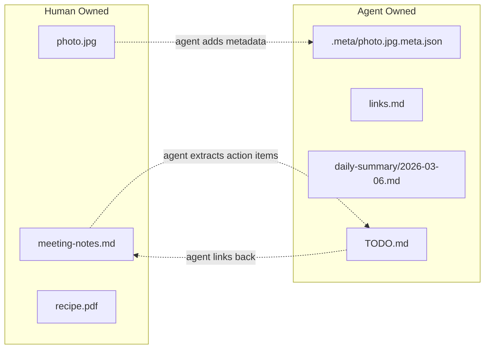
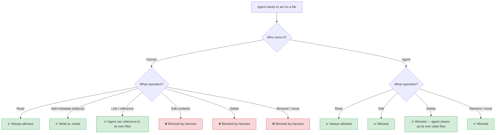
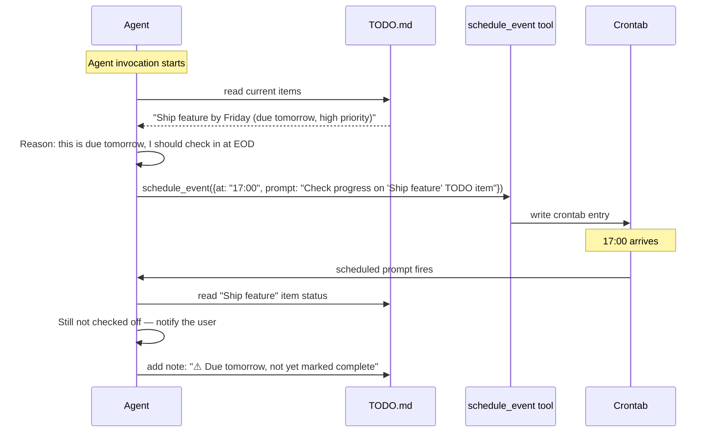
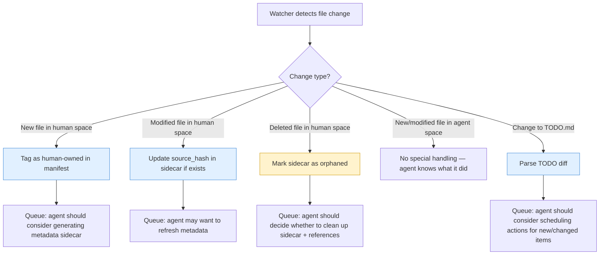

# Brain — Watch Folder Design Proposal

> **Audience:** Developer picking this up for implementation.
> **Status:** Proposal / RFC — not yet implemented.

## The Idea

The watched folder is the agent's "brain" — a shared filesystem space where the human stores their artifacts and the agent organizes, annotates, links, and builds on top of them. Two rules govern everything:

1. **Human artifacts are sacred.** The agent never deletes, overwrites, or degrades a file the human created. It can only *add* to them (metadata, annotations, links).
2. **Agent artifacts are ephemeral.** The agent can freely create, edit, and delete its own files. Stale agent-generated content is the agent's responsibility to clean up.

## Ownership Model

Every file in the brain has an **owner**: `human` or `agent`. Ownership is determined at creation time and never changes.



### How ownership is tracked

The agent needs a reliable way to know what it created vs. what the human added. Options (see QUESTIONS.md Q4):

- **Convention:** Agent files always live under specific agent-owned directories (e.g., `.meta/`, `daily-summary/`), or carry a marker in their frontmatter/metadata.
- **Manifest:** An agent-maintained index file (e.g., `.brain/manifest.json`) that lists every agent-created path.
- **Extended attributes / dotfile sidecars:** A `.ownership` marker per file.

Regardless of mechanism, the watcher must tag new files with their origin on creation and the harness must enforce the ownership rules before any write/delete tool call executes.

## Folder Structure

Minimal by design. Only a few top-level directories, with the human free to organize their own files however they want.

```
brain/                          ← the watched folder root
├── .brain/                     ← agent internals (hidden, agent-owned)
│   ├── manifest.json           ← ownership registry
│   └── index.json              ← search/link index
├── .meta/                      ← sidecar metadata for human files (agent-owned)
│   ├── photo.jpg.meta.json
│   └── meeting-notes.md.meta.json
├── TODO.md                     ← unified todo file (agent-owned)
├── daily-summary/              ← agent-generated summaries (agent-owned)
│   ├── 2026-03-05.md
│   └── 2026-03-06.md
│
│   ── everything else is human territory ──
│
├── photos/                     ← human's own folders
│   └── photo.jpg
├── meetings/
│   └── meeting-notes.md
└── recipes/
    └── recipe.pdf
```

### Directory Roles

| Path | Owner | Purpose |
|---|---|---|
| `.brain/` | Agent | Internal bookkeeping — manifest, indices, caches. Hidden from casual browsing. |
| `.meta/` | Agent | Sidecar metadata files that annotate human artifacts. One `.meta.json` per human file, mirroring the relative path. |
| `TODO.md` | Agent | The unified task/action-item file. Acts as a lightweight database for both the agent and the frontend. |
| `daily-summary/` | Agent | Periodic summaries the agent generates. |
| Everything else | Human | The human's own files and folders. Agent reads freely but never modifies or deletes. |

## Permitted Operations by Ownership



## Sidecar Metadata

When the agent wants to enrich a human file — tag a photo, extract keywords from a document, log when it was last referenced — it writes a **sidecar** in `.meta/`.

Example: the human drops `photos/vacation.jpg` into the brain. The agent detects it, analyzes the image, and writes:

```json
// .meta/photos/vacation.jpg.meta.json
{
  "source_path": "photos/vacation.jpg",
  "source_hash": "sha256:ab12cd...",
  "created_by": "agent",
  "created_at": "2026-03-06T14:22:00Z",
  "tags": ["photo", "vacation", "beach", "2025"],
  "description": "Beach sunset photo, likely from July 2025 trip.",
  "extracted_text": null,
  "linked_from": ["daily-summary/2026-03-06.md"],
  "custom": {}
}
```

The `.meta/` directory mirrors the brain's folder structure so paths stay intuitive and collisions are impossible.

## The Unified TODO File

`TODO.md` is the most important agent-owned file. It serves three roles simultaneously:

1. **Agent context** — The agent reads it on every invocation to understand what's pending, what's been done, and what might need scheduling.
2. **Frontend database** — The companion frontend reads and renders it as a task board. Structured enough to parse, human-readable enough to edit by hand if needed.
3. **Scheduling bridge** — Items in the TODO can trigger the agent to call `schedule_event` (from SCHEDULING.md) to set up deferred actions.

### Format

```markdown
# TODO

## Active

- [ ] Ship feature by Friday `origin:meetings/2026-03-06-standup.md` `due:2026-03-07` `priority:high`
- [ ] Review PR #42 `origin:agent` `due:2026-03-06` `priority:medium`
- [x] Send weekly summary `origin:cron/weekly-summary` `completed:2026-03-06T17:00:00Z`

## Someday

- [ ] Organize photos folder by year `origin:agent` `priority:low`

## Done (last 7 days)

- [x] Retrieve standup transcript `origin:schedule/evt_abc123` `completed:2026-03-06T10:36:00Z`
```

### Key Properties

- **Inline metadata** via backtick-wrapped key-value pairs — parseable by both the frontend and the agent, invisible clutter to a human skimming the file.
- **`origin` tag** — Links every item back to where it came from: a human file, a scheduled event, a cron task, or the agent's own initiative.
- **Sections** — `Active`, `Someday`, `Done`. The agent manages section placement. Completed items roll into `Done` and are pruned after a configurable TTL.

### How the TODO Connects to Scheduling



## How the Watcher Interacts with the Brain

When the Folder Watcher detects a change, the Event Router needs to classify it before forwarding to the agent:



## Agent-to-Agent Linking

The agent can create **link files** — small markdown documents whose primary purpose is to connect related artifacts:

```markdown
<!-- daily-summary/2026-03-06.md -->
# Daily Summary — March 6, 2026

## Meetings
- [Standup transcript](../meetings/2026-03-06-standup.md) — Action items extracted to TODO.md

## New Files
- [vacation.jpg](../photos/vacation.jpg) — Beach sunset, auto-tagged

## Scheduled
- 17:00 — EOD TODO review
```

These files are agent-owned and disposable. They give the agent (and the human) a narrative view of what happened, while the underlying human files remain untouched.

## Implementation Notes

### Harness enforcement

The ownership check must happen **inside the tool handler**, not in the LLM prompt. Prompts can be ignored; tool-level checks cannot. The `write_file` and `delete_file` handlers should:

1. Resolve the target path.
2. Look up ownership in the manifest (or check if the path falls under an agent-owned directory).
3. Block the operation and return an error to the LLM if the human-owned file would be modified/deleted.

### Manifest bootstrap

On first run (or if the manifest is missing), Carson should scan the brain directory and assume everything that doesn't match an agent-owned path pattern is human-owned. The agent then builds its manifest from that scan.

### Frontend protocol

The frontend reads `TODO.md` and the `.brain/` directory directly from disk. No API needed — the watch folder *is* the API. The frontend watches for changes the same way Carson does.

### Open questions

See [QUESTIONS.md](QUESTIONS.md) — brain-related questions are tracked under **Brain / Watch Folder**.
