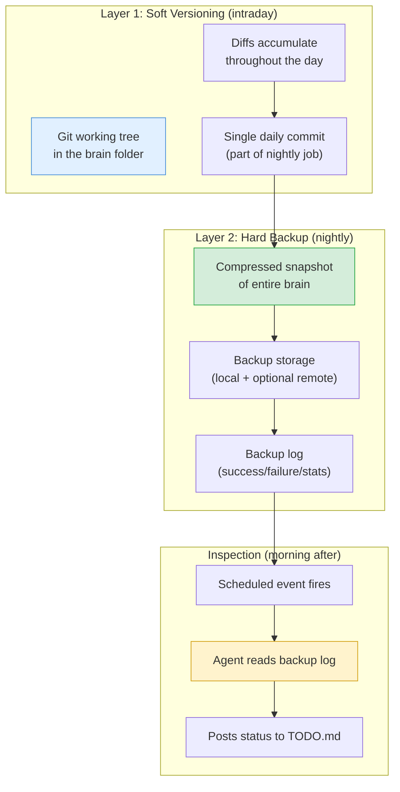
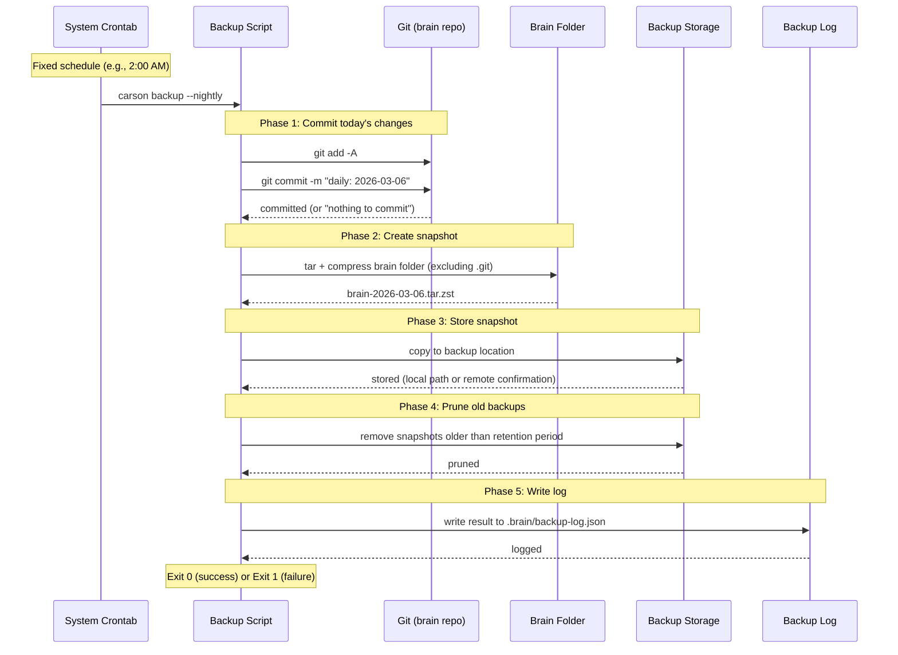
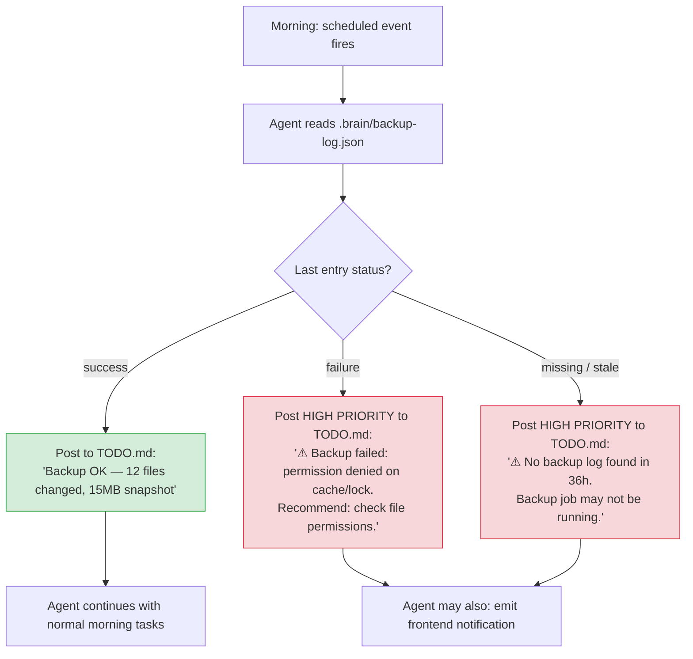
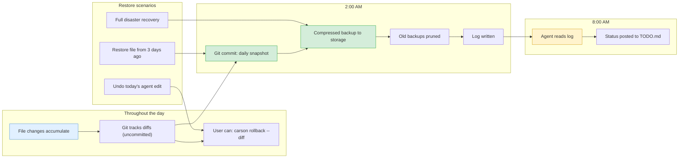

# Versioning & Safety — Design Proposal

> **Audience:** Developer picking this up for implementation.
> **Status:** Proposal / RFC — not yet implemented.

## The Problem

The brain folder is the most valuable thing Carson manages. Over weeks and months of use it accumulates human artifacts, agent-generated context, linked metadata, TODO history, and meeting transcripts — an irreplaceable personal knowledge base. Losing it or silently corrupting it would be catastrophic.

We need a versioning and backup strategy that satisfies several competing constraints:

1. **Rollback must be possible** — If the agent makes a bad edit or a series of bad edits, the user needs to rewind to a known-good state.
2. **Backup must be reliable** — It can't depend on the LLM remembering to do it, or the user remembering to click a button.
3. **It can't bloat the agent's context** — Giving the LLM a `backup` tool means it has to reason about when to call it, which wastes tokens and introduces non-deterministic gaps.
4. **It can't silently fail** — A daemon-only backup that the user never sees will eventually break, and nobody will notice until it's too late.
5. **It shouldn't impose a dev/staging/prod workflow** — This is a personal brain, not a deployment pipeline.
6. **Git-on-every-change is noisy** — Constant commits create an unusable history and don't serve as real backups.

No single mechanism solves all of these. The proposal is a **two-layer system**: soft versioning for intraday rollback, and hard backups for disaster recovery — with the agent involved only in the inspection step, never in the backup execution itself.

## Two-Layer Architecture



### Why two layers

| Concern | Soft versioning handles it | Hard backup handles it |
|---|---|---|
| "Undo the last agent edit" | Yes — `git diff` / `git checkout` | Overkill |
| "Restore the brain from last Tuesday" | No — only has today's diffs | Yes |
| "Disk failed, everything is gone" | No — git repo is on the same disk | Yes (if remote storage configured) |
| "Agent made a series of bad edits over 3 hours" | Partially — diffs are available but granularity depends on watcher | Yes — nightly snapshot is clean |
| "I want to see what changed today" | Yes — `git diff` is perfect for this | No |

---

## Layer 1: Soft Versioning

The brain folder is a **git repository**, but not one the user or agent interacts with as a development workflow. Git is used purely as a change-tracking substrate.

### How it works

1. **On daemon startup**, Carson initializes a git repo in the brain folder if one doesn't exist (`.git/` is added to the brain, `.brain/.gitignore` excludes temp files and caches).
2. **Throughout the day**, the folder watcher records file changes as usual. Git sees the diffs but nothing is committed yet.
3. **On nightly job** (see Layer 2), all accumulated changes are committed in a single automated commit before the backup snapshot runs.
4. **On user request**, `carson rollback` can checkout a previous state or show diffs.

### What git gives us

- `git diff` — See everything that changed since last commit (i.e., since last night).
- `git log` — History of daily snapshots going back as far as the repo exists.
- `git checkout <hash> -- path/to/file` — Restore a specific file from a previous day.
- `git stash` — Temporarily set aside today's changes to inspect yesterday's state.

### What git does NOT do here

- No branches. No merges. No pull requests. One linear history.
- No pushes to a remote (that's Layer 2's job if remote backup is configured).
- No commits triggered by the agent or by individual file changes. One commit per day, period.
- No `.gitignore` complexity — everything in the brain is tracked except `.brain/cache/` and temp files.

### The `carson rollback` command

A CLI tool for the user (not the agent) to interact with soft versioning:

```
carson rollback --list              # show daily commits with stats
carson rollback --diff 2026-03-05   # show what changed on that day
carson rollback --file meetings/standup.md --to 2026-03-04  # restore one file
carson rollback --to 2026-03-04     # restore entire brain to that date (with confirmation)
```

This is a **user-facing** command, not an agent tool. The agent should not be rolling back the brain.

---

## Layer 2: Hard Backup

A deterministic, daemon-managed backup that runs on a fixed schedule. No LLM involvement in execution. No user action required. It just runs.

### Nightly job sequence



### Backup log

The backup script writes a structured log entry after every run. This is the bridge between the deterministic backup and the non-deterministic agent — the agent reads the log, it doesn't run the backup.

```json
// .brain/backup-log.json (append-only, one entry per run)
[
  {
    "timestamp": "2026-03-06T02:00:14Z",
    "status": "success",
    "type": "nightly",
    "git_commit": "a1b2c3d",
    "git_stats": { "files_changed": 12, "insertions": 340, "deletions": 28 },
    "snapshot": {
      "path": "/var/carson/backups/brain-2026-03-06.tar.zst",
      "size_bytes": 15482930,
      "file_count": 247
    },
    "pruned": ["brain-2026-02-04.tar.zst"],
    "errors": []
  },
  {
    "timestamp": "2026-03-05T02:00:09Z",
    "status": "failure",
    "type": "nightly",
    "errors": ["tar: permission denied on .brain/cache/lock"],
    "git_commit": null,
    "snapshot": null
  }
]
```

### Where backups are stored

```
/var/carson/backups/          ← default local backup directory
├── brain-2026-03-06.tar.zst
├── brain-2026-03-05.tar.zst
├── brain-2026-03-04.tar.zst
└── ...
```

Optional remote targets (configured in `.env`):
- A second local disk / mounted volume
- An S3-compatible bucket
- rsync to a remote host

The backup script supports multiple targets. If the primary succeeds and a secondary fails, it logs the partial failure but doesn't block.

### Retention policy

| Tier | Kept for | Granularity |
|---|---|---|
| Daily | 7 days | Every nightly snapshot |
| Weekly | 4 weeks | One snapshot per week (Sunday night) |
| Monthly | 6 months | One snapshot per month (1st of month) |

Old snapshots are pruned automatically during the nightly job. The tiered policy keeps storage bounded while preserving long-term restore points.

---

## The Inspection Loop

This is where the agent gets involved — not in running backups, but in **reading the result and raising alarms**. The agent is good at this: reading a log, noticing something wrong, and surfacing it.

### How it works

The nightly backup writes to `.brain/backup-log.json`. A scheduled event (fixed, non-removable entry in the cron table) fires the next morning and prompts the agent:

```
Prompt: "Read .brain/backup-log.json and check the most recent entry.
If the backup succeeded, post a brief status summary as the first item
in TODO.md (under a '## System' section). If the backup failed or has
warnings, post a high-priority TODO item explaining the failure and
recommending action. If the log file is missing or the most recent
entry is more than 36 hours old, treat that as a failure."
```



### Why this pattern works

- **Backup execution is deterministic** — a shell script on a cron schedule. No tokens spent, no LLM flakiness, no context bloat.
- **Failure detection is non-deterministic but bounded** — the agent reads one small JSON file and makes a judgment call. This is a trivial task that costs minimal tokens.
- **User visibility is guaranteed** — the status appears in `TODO.md`, which the desktop app renders. If something is wrong, the user sees it on their task board and gets a notification.
- **Silent failure window is capped at ~36 hours** — if the backup fails AND the inspection fails, the next day's inspection catches the 36-hour staleness.

---

## Nightly Job: The Fixed Cron Entry

The backup and inspection schedule is a **non-removable** entry in Carson's crontab block. The agent cannot delete or modify it via `schedule_event` or `cancel_scheduled_event`. It's infrastructure, not agent behavior.

```crontab
# >>> CARSON MANAGED — DO NOT EDIT <<<
# [SYSTEM:backup] Nightly brain backup — DO NOT REMOVE
0 2 * * * /usr/local/bin/carson backup --nightly
# [SYSTEM:backup-inspect] Morning backup inspection — DO NOT REMOVE
0 8 * * * /usr/local/bin/carson run-scheduled --task backup-inspect
# ... other agent-managed entries ...
# <<< CARSON MANAGED >>>
```

Entries prefixed with `SYSTEM:` are protected. The `schedule_event` and `cancel_scheduled_event` tools reject operations on system entries.

---

## Soft + Hard: How They Complement Each Other



### Restore scenarios mapped to mechanisms

| Scenario | Mechanism | Command |
|---|---|---|
| "Undo the agent's last change to TODO.md" | Git working tree | `carson rollback --file TODO.md` (restores from last commit) |
| "See everything the agent changed today" | Git diff | `carson rollback --diff today` |
| "Restore my meeting notes from last Wednesday" | Git history | `carson rollback --file meetings/standup.md --to 2026-03-04` |
| "Restore the entire brain from last week" | Hard backup | `carson restore --from 2026-02-28` |
| "My disk died, I need everything back" | Remote hard backup | `carson restore --from remote --latest` |
| "What changed between two dates?" | Git log + diff | `carson rollback --diff 2026-03-01..2026-03-05` |

---

## What We Deliberately Excluded

### No LLM backup tool
Giving the agent a `backup` tool means it has to decide *when* to call it. That decision wastes tokens on every invocation ("should I backup now?"), introduces non-deterministic gaps (what if it forgets for a week?), and doesn't add value over a deterministic cron job. The agent's role is **inspection**, not execution.

### No git-on-every-change
Committing on every file change creates an unusable history (hundreds of commits per day), makes `git log` worthless for rollback, and adds I/O overhead to every watcher event. One commit per day strikes the right balance — granular enough for daily rollback, clean enough to browse.

### No dev/staging/prod
The brain is not a software project. Branching, merging, and environment promotion add cognitive overhead that doesn't match the use case. The linear git history (one commit per day) is the entire "versioning workflow."

### No user-initiated backup button (as the primary mechanism)
A button is fine as a supplement ("backup now before I do something risky") but not as the primary mechanism. Users forget. Users go weeks without thinking about backups. The nightly job doesn't forget.

### No remote-first storage
Backups are local-first. Remote storage is optional. This keeps the system functional without internet access and avoids cloud dependencies for a locally-run service. Users who want remote backup configure it explicitly.

---

## Implementation Notes

### Build order

1. **Git initialization** — On daemon startup, ensure the brain folder has a `.git`. Create if missing. Add `.brain/cache/` to `.gitignore`.
2. **`carson backup --nightly` script** — Git add + commit, tar + compress, copy to backup dir, prune, write log. Must be idempotent (running twice on the same day is a no-op on the commit, creates a second snapshot but doesn't break anything).
3. **`carson rollback` CLI** — User-facing commands for diffing, restoring files, and restoring full snapshots. Must include confirmation prompts for destructive restores.
4. **Protected cron entries** — Add `SYSTEM:` prefix logic to the cron manager. Ensure `schedule_event` and `cancel_scheduled_event` reject operations on these entries.
5. **Backup inspection scheduled event** — The `backup-inspect` task definition that reads the log and posts to TODO.md.
6. **`carson restore` CLI** — Full brain restore from a hard backup snapshot. Destructive operation — requires explicit confirmation and creates a pre-restore snapshot first.

### Platform notes

- **Compression:** Use `zstd` for snapshots — fast, good ratio, widely available. Fall back to `gzip` if `zstd` isn't installed.
- **Atomic writes:** The backup log must be written atomically (write to temp file, rename) to avoid corruption if the backup script is killed mid-write.
- **Git in the brain:** The `.git` directory is excluded from hard backup snapshots — the snapshot is a clean archive of the content, not the version history. Git history lives only in the brain folder itself.

### Open questions

See [QUESTIONS.md](QUESTIONS.md) — versioning-related questions are tracked under **Versioning & Safety**.
